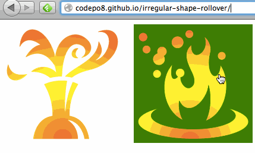

Irregular shape rollover
------------------------

This is a quick demo showing how you can use the HTML5 Canvas API to create a rollover for irregular shapes. 

You can try out the demo at http://codepo8.github.io/irregular-shape-rollover/ 

The usage of this example is very simple. Just include the shaperollover.js script and add a class of `rollover` to each image you want to add a roll-over effect to. 

These images should be PNG or GIF images with transparent and non-transparent parts. Every time your mouse cursor is over a non-transparent pixel the image gets a class of `over` added to it. When the cursor is on a transparent pixel the class gets removed.

Under the hood what happens is that when you mouse over an image with a class of `rollover` the image gets copied into a Canvas element and moving the mouse then reads the colour of the pixel at the mouse position. If that pixel has an alpha of zero, you outside the shape, if it doesn't, you are in it.

If you want to embed the images into a link and make sure that only the areas inside the rollover will be clickable take a look at the demo inlined in index.html. The trick is to add an event listener to the link and check if the image inside it has a class of `over` when the click happens. If it doesn't, simply call `preventDefault()` which stops the link from being followed.

